# IBM Virtual Garden

**Disclaimer:** *This is not an official IBM github repository. This is a personal repository used for demo/workhsop purposes.*

This demo is intented to showcase IBM Watson IoT Platform and walk you through the process of using the IoT Platform as an MQTT broker in a simple web based application that simulates a real life example.

In this demo, we have a virtual garden and we need the water sprinklers to start automatically when the humidity level reaches a certain threshold. We will use the Watson IoT platform to create a simulated device that will act as a humidity sensor. The sensor will keep sending humidity levels and our web app (virtual garden) will receive these humidity readings and decide whether to start the sprinklers or not.

# Table of Contents
1. [Overview](#IBM-Virtual-Garden)
2. [Prerequisites](#2-prerequisites)
3. [Instructions](#3-instructions)
    * [3.1 Login to the IBM Cloud Platform](#31-Login-to-the-IBM-Cloud-Platform)
    * [3.2 Create a new Watson IoT Platform instance](#32-Create-a-new-Watson-IoT-Platform-instance)
    * [3.3 Launching the Iot Platform](#33-Launching-the-Iot-Platform)
    * [3.4 Setting up your platform](#34-Setting-up-your-platform)
    * [3.5 Creating the virtual device](#35-Creating-the-virtual-device)
    * [3.6 Generating an API Key](#36-Generating-an-API-Key)
    * [3.7 Enabling unsecure connections](#37-Enabling-unsecure-connections)
    * [3.8 Running the web app](#38-Running-the-web-app)
4. [Conclusion](#4-conclusion)

# 2. Prerequisites
1. An IBM Account. You can get one [here](https://ibm.biz/BdqD9k)

2. Any code editor of your choice.

# 3. Instructions

Make sure you have already signed up & activated your account as instructed in the prerequisites above.

## 3.1 Login to the IBM Cloud Platform

Go to https://cloud.ibm.com and sign in

## 3.2 Create a new Watson IoT Platform instance

As shown in the gif below
1. Navigate to Catalog from the navigation bar above

2. Type 'IoT' in the search bar

3. Look for 'Internet of Things Platform' and click on it

4. Leave everything on the default values (The free plan will be selected by default)

5. Click on the blue 'Create' Button

  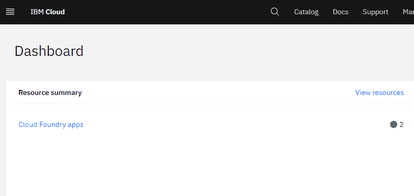

## 3.3 Launching the Iot Platform

At this point, you should now have your own Iot Platform instance on your account. By default when you create a new IoT Platform, it redirects you to the resource page which looks like this

  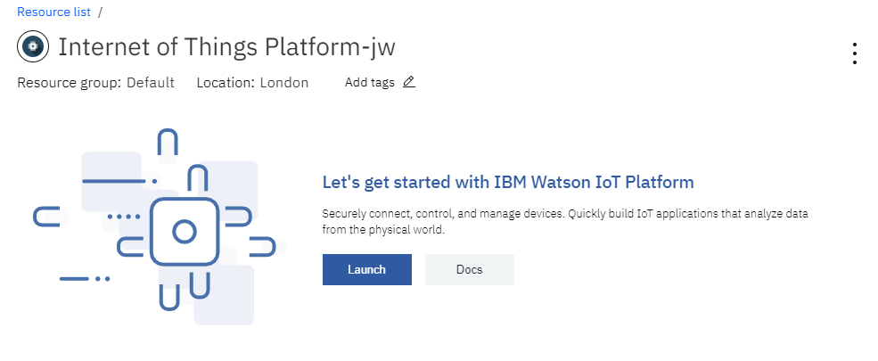

Click the 'Launch' button, so we can start interacting and setting up our IoT Platform.

*Note: if you lost the resource page or want to return to it in the future, you can find all your resources under the [resource list](https://cloud.ibm.com/resources)* page

When you launch the IoT Platform, it might ask you to login again, you will probably find a blue signin button at the top right of the screen, click it and sign in again. Then you will be asked to select your organization ID, click on your account and select your org ID as show in the gif below:

  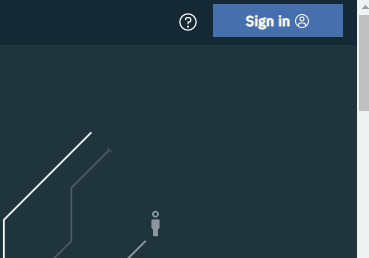

## 3.4 Setting up your platform

In this step, we will find our org ID and write it down as we will need it later on when we connect to the platform from our web app. Also we will enable the device simulation option.

Navigate to Settings from the left side menu and note your organization ID, copy and paste it somewhere because we will need it later on. Check below gif.

  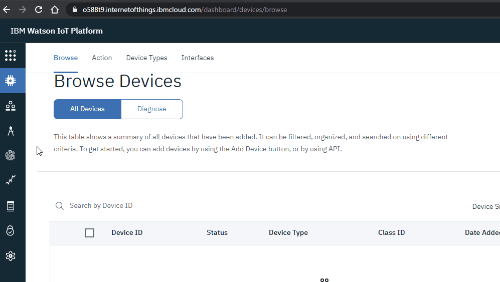

*Note: The org ID can also be seen in the browser url above*

Now on the same settings page, scroll down and enable the **'Activate Device Simulator'** option. Check the gif below:

  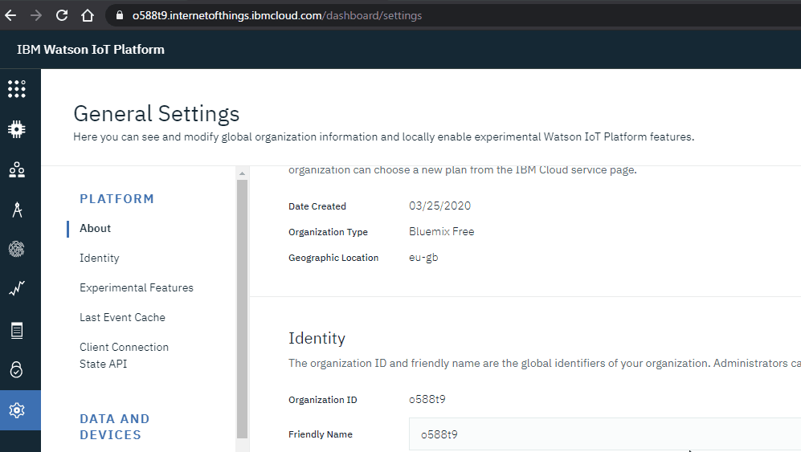

## 3.5 Creating the virtual device

Navigate to Devices page from the left side menu and click the **'New Device'** button. 
1. Create a new device type called 'test'

2. Type '1234' in the device ID. 

3. Keep clicking next and leave everything else untouched (default values)

*note #1: stick to the values above, because we will use them later in our code*

*note #2: you don't need to copy or save the device auth token. we won't need it because we are not using a real physical device*

Check the gif below:

  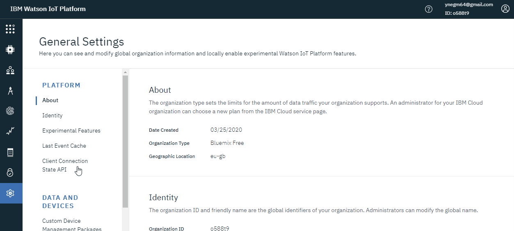

Now we need to create the simulated device and attach it to the device we just created. In order to do that follow the following steps:

1. Click on the tab that says '0 Simulations running' (you can find it at the bottom right)

2. Click on the **'Create simulation'** button

3. Write 'test' in the device type (remember we created a device type called **'test'** in the previous step)

4. Change the event name to 'sensor_reading'

5. Change the schedule value to '12' *(This means that the simulated device will send 12 events per minute which means it will send an event each 5 seconds)*

You can change this to any frequency you want, you can even change minutes to hours depending on your application.

The payload is the message that this device will send, here it shows that it will send a random number between 0 and 100. For this demo's purpose, we will take this random number as our humidity sensor reading.

  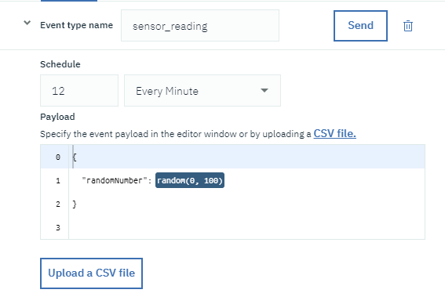

6. Click on the **'Save'** button

7. Click on the **'Use Registered Device'** button

8. Pick the device we created earlier (ID: 1234)

9. You might need to reload the page for the simulator to start working and send events

See the gif below for reference:

  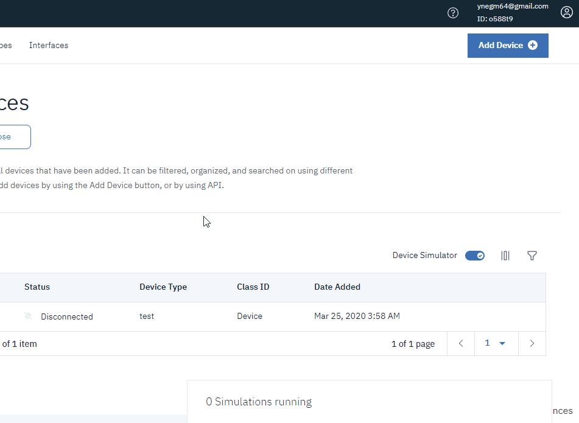

## 3.6 Generating an API Key

Now that we have our simulated device sending these events. We will now create our API key that will be used by our web app to receive and listen for those events.

1. Navigate to Apps page from the left side menu and click the **'Generate API Key'** button at the top right.

2. Write anything in the description, it won't really matter.

3. Set the role to a 'Standard Application'

4. Copy & save the API Key and the Authorization Token as these will act as our username and password when we connect to the platform from the web app.

See the gif below for reference:

  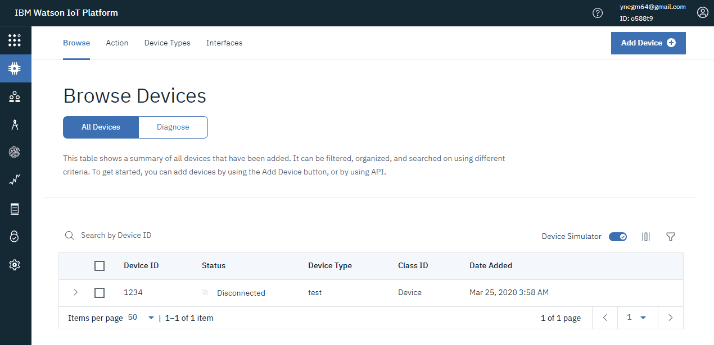

## 3.7 Enabling unsecure connections

By default the IBM Watson IoT Platform only allows connections over TLS protocols to encrypt the data that are being sent between the devices. However, for the sake of this demo, we will keep it simple and allow unsecure connections to take place.

1. Navigate to Security page from the left side menu

2. Change the **Security Level** from 'TLS with Token Authentication' to 'TLS Optional' 

3. Click Save

## 3.8 Running the web app

Now that we have everything ready, it's time run the web app.

1. Download the project from this repo by forking it or by downloading it directly from github

  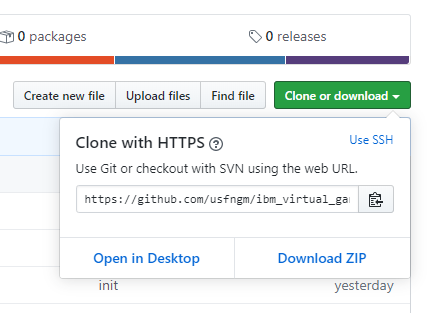

2. Open the project folder, navigate to the folder named **'js'** and open the file named **'main.js'**

3. Edit the options object as follows

   This is the orignal main.js values, we will remove the xxx with our values that we saved before

  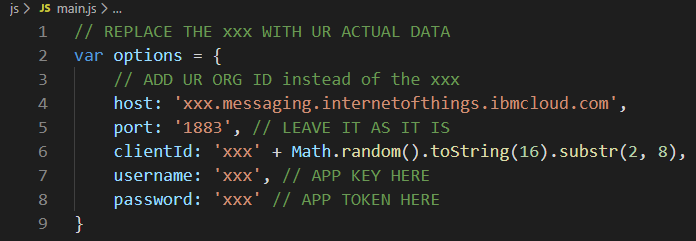

   Below are the values I saved and obtained:

   **org id:** o588t9 
   **api key:** a-o588t9-jzaimn27ag 
   **auth token:** oyQAr0DaSn1)?PGriA

   **Note: USE YOUR OWN IDs, KEYS & TOKENS. The above will be deleted by the time you try to use them**

   Most of the above are straight forward except the clientID which we will see how we can deal with it but lets first put everything else in place

   the **org id** will go in the first xxx in the **host**

   the **api key** will go in the **username**

   the **auth token** will go in the **password**

   The **clientId** is taken also from the **api key** but with a little bit of a modification, here our api key is **a-o588t9-jzaimn27ag**, we will take it all and remove last string after the '-' which leaves us with **a-o588t9-**. Now instead of the '-' we will add ':' so the **a-o588t9-** will become **a:o588t9:** 

   So with the following data

   **org id:** o588t9 
   **api key:** a-o588t9-jzaimn27ag 
   **auth token:** oyQAr0DaSn1)?PGriA

   Our final file should look like this:

  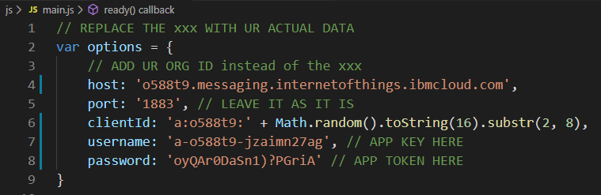

4. Save the file and close it

5. Open **index.html** and you should see it working and reading the random humidity readings sent by our virtual device on IBM Cloud Platform. See gif below:

  

# 4. Conclusion
This demo acts as a quickstart to help you get going with your IoT projects and shows you how to use the simulated device feature on IBM Watson IoT Platform to send events and how to connect to the platfrom from a web app using an MQTT client.

For any inquires or issues you have faced and not able to solve, please don't hesitate to contact me via my email: youssef.negm@ibm.com